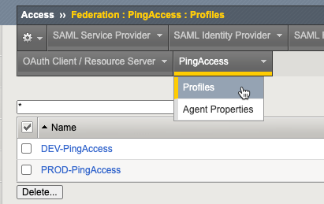

# Ansible playbook to create n-number Ping Access Profiles on n-number Big-IP's 



The playbook uses these REST API endpoints:
| API Endpoint | Purpose 
| :------ | :------ | 
| `/mgmt/shared/file-transfer` | Upload PingAccess Properties file to Big-IP filesystem |
| `/mgmt/tm/apm/aaa/ping-access-properties-file` | Check/Create PingAccess Properties file | 
| `/mgmt/tm/apm/profile/ping-access` | Check/Create PingAccess Profile |

Note: The playbook is idempotent and will check if properties file or profile already exists before making changes.

Required vars:
```yaml
PingAccessProfiles:
  - name: "PROD-PingAccess" #Name of PingAccess Profile
    pingAccessPropertiesFile: "files/agent.properties" # path to PingAccess Properties file on ansible filesystem
    pool: "/Common/1.1.1.1" #This is required to already exist on Big-IP. 
    serversslProfile: "/Common/serverssl" #This is required to already exist on Big-IP. 
    useHttps: "true" #Specified by Ping Access Team or your security requirements. 
  - name: "DEV-PingAccess" #Name of PingAccess Profile
    pingAccessPropertiesFile: "files/agent.properties" # path to PingAccess Properties file on ansible filesystem
    pool: "/Common/1.1.1.1" #This is required to already exist on Big-IP. 
    serversslProfile: "/Common/serverssl" #This is required to already exist on Big-IP. 
    useHttps: "true" #Specified by Ping Access Team or your security requirements. 
```